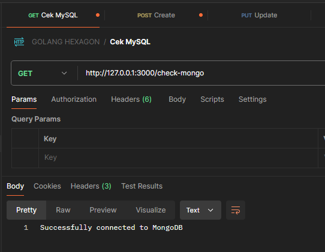
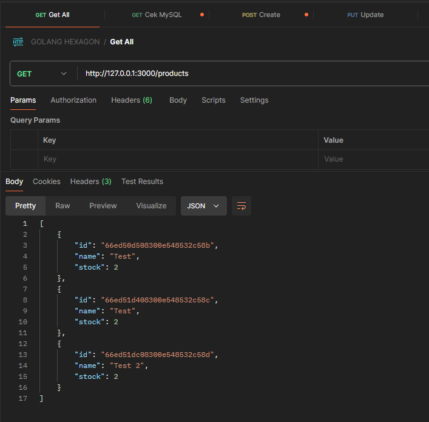
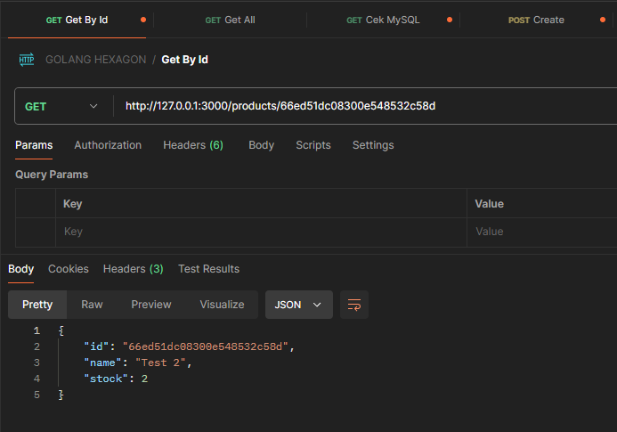
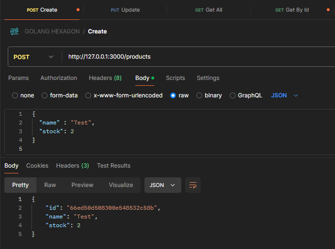
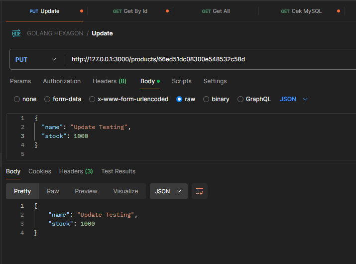
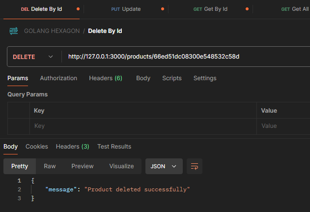

# Go Hexagon Project

## Deskripsi

Proyek ini adalah contoh implementasi Arsitektur Hexagonal dengan Golang menggunakan Go Fiber sebagai framework web dan Gorm untuk ORM dengan PostgreSQL.

## Setup Proyek

1. Inisialisasi Proyek: Jika kamu belum menginisialisasi modul Go, jalankan perintah berikut untuk memulai modul:

   ```sh
   go mod init go-hexagon
   ```

2. Instalasi Dependensi: Jalankan perintah berikut untuk menginstal semua dependensi yang diperlukan

- Go Fiber sebagai web framework:
   ```sh
   go get github.com/gofiber/fiber/v2
   ```
   
- GORM sebagai ORM untuk MySQL:

   ```sh
   go get gorm.io/gorm
   go get gorm.io/driver/mysql
   ```

- Instal MongoDB driver:

   ```sh
   go get go.mongodb.org/mongo-driver/mongo
   ```

- Testify untuk testing:

  ```sh
   go get github.com/stretchr/testify
   ```

3. Mengelola Dependensi: Setelah menginstal dependensi, jalankan perintah berikut untuk membersihkan dan merapikan modul:

   ```sh
   go mod tidy
   ```

## Cara Menjalankan Aplikasi

1. Pastikan MySQL dan MongoDB berjalan.
2. Jalankan aplikasi dengan database yang diinginkan:
   Ke MySQL

   ```
   go run cmd\main.go --db=mysql
   ```

   Ke MongoDB

   ```
   go run cmd\main.go --db=mongodb
   ```

## API Endpoint
* Untuk endpoint mongo dan mysql sama

- GET /check-mongo - Cek koneksi ke MongoDB

- GET /products - Mendapatkan daftar produk

- GET /products/:id - Mendapatkan detail produk berdasarkan ID

- POST /products - Membuat produk baru

- PUT /products/:id - Memperbarui produk berdasarkan ID

- DELETE /products/:id - Menghapus produk berdasarkan ID


## Cara Menjalankan Unittest

Proyek ini menggunakan Testify untuk menulis unit test. Berikut adalah langkah untuk menjalankan unittest:

1. Jalankan perintah berikut untuk menjalankan semua unit test di proyek:

   ```
   go test ./tests
   ```

## Penjelasan Arsitektur Hexagonal

Arsitektur Hexagonal (atau Ports and Adapters) adalah pola desain perangkat lunak yang memisahkan logika bisnis inti dari komponen eksternal seperti framework web atau database. Dengan cara ini, aplikasi menjadi lebih fleksibel untuk diubah tanpa mempengaruhi logika inti.

Komponen Utama:
- Entity: Mewakili objek domain, seperti Product, yang menjadi pusat logika bisnis.
- Port: Antarmuka yang menghubungkan core (logika bisnis) dengan adapter eksternal seperti database.
- Service: Implementasi dari logika bisnis, yang memanggil port untuk berinteraksi dengan data.
- Repository: Adapter yang bertugas mengimplementasikan port untuk berkomunikasi dengan database, seperti MySQL atau MongoDB.
- Handler: Menghubungkan HTTP request dari client ke service.

## Keuntungan Menggunakan Arsitektur Hexagonal

1. Isolasi Logika Bisnis: Memisahkan logika bisnis dari detail teknis membuat aplikasi lebih mudah untuk dipelihara dan diubah.
2. Fleksibilitas: Memungkinkan penggunaan berbagai teknologi tanpa mempengaruhi logika inti aplikasi.
3. Pengujian Mudah: Memudahkan penulisan tes unit karena komponen-komponen yang berbeda dapat diuji secara terpisah.
4. Skalabilitas: Membantu dalam membangun aplikasi yang dapat diskalakan dengan memisahkan kekhawatiran antara komponen.
